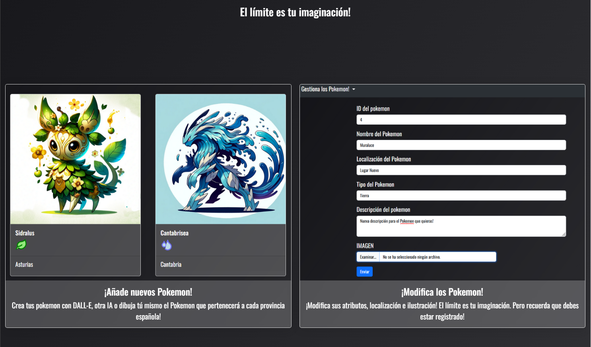
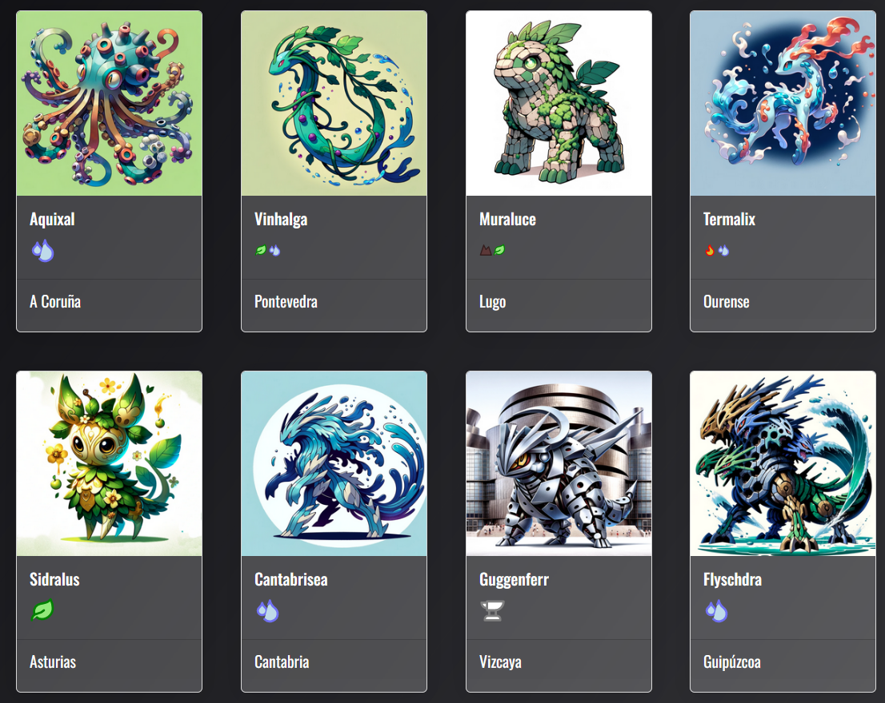

# SPA Proyecto Fan-Made Inspirado en Pokémon - Edición Provincias Españolas

Este proyecto es un SPA (Single Page Application) fan-made, creado por y para fans del universo Pokémon con un enfoque educativo y de entretenimiento. La aplicación está inspirada en las diversas provincias españolas, utilizando características únicas de cada una, desde su cultura y geografía hasta las leyendas locales, para representar criaturas al estilo Pokémon.

Este proyecto es puramente fan-made, sin ánimo de lucro, y busca ofrecer una experiencia interactiva y educativa a través de un entorno web amigable y dinámico.

## Características

- **Registro y Autenticación de Usuarios**: Para una experiencia personalizada, los usuarios pueden registrarse e iniciar sesión, gestionando así sus propias criaturas inspiradas en las provincias españolas.
  
- **Gestión de Criaturas**: A través de una interfaz intuitiva, los usuarios pueden crear, editar y eliminar sus criaturas, añadiendo un toque personal a la experiencia.

- **Diseño Responsive**: Utilizando Bootstrap, el diseño se adapta a cualquier tamaño de pantalla, asegurando una experiencia de usuario óptima en dispositivos móviles, tablets y PCs.

- **Componentes Dinámicos**:
  - **Header**: Presenta la aplicación y proporciona navegación.
  - **Card**: Muestra información detallada de cada criatura, incluyendo imágenes y descripciones.
  - **Pagination Controls**: Facilita la navegación entre diferentes páginas de criaturas, mejorando la experiencia de usuario.

## Instalación y Configuración

### Requisitos Previos

Asegúrate de tener un entorno de desarrollo con Node.js instalado para ejecutar la aplicación.

### Instalación

1. **Clonar el Repositorio**: Clona el repositorio a tu entorno local utilizando `git clone https://github.com//tu-spa-proyecto.git cd tu-spa-proyecto`.

2. **Instalar Dependencias**: Ejecuta `npm install` para instalar las dependencias necesarias para el proyecto.

3. **Configurar Variables de Entorno**: Copia el archivo `.env.example` a un nuevo archivo `.env` y ajusta las variables según tu configuración.

4. **Ejecutar el Proyecto**: Utiliza `npm start` para iniciar la aplicación. La SPA estará accesible a través de un navegador web.

## Consideraciones

Este proyecto está en constante evolución, buscando mejorar y expandir sus funcionalidades. Es importante mencionar que, dado su estado actual, es probable que existan errores o aspectos incompletos. Sin embargo, estos serán abordados en futuras actualizaciones, con el objetivo de ofrecer una herramienta educativa integral para futuros estudiantes y entusiastas del desarrollo web y del universo Pokémon.

Proyecto realizado por Alfredo Alberruche para la asignatura Desarrollo Web en Entorno Cliente.
